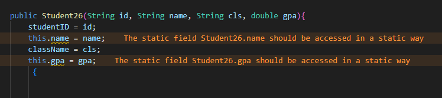

# HOLAAA IM Wahyu Fairuz Daniswara
CLASS:TI 1I
ABSENT: 26
NIM:244107020225
# Labs #2 Programming Fundamentals Review
2.1 Experiment 1: Declaring Classes, Attributes, and Methods
Answer from the question Experiment 1
1.
2.There are 4 attributes StudentID(String),Name(String),ClassName(String),GPA(Double)
3.Thereare 4 methods 
  1.print() the function is to print students details
  2.ChangeClass the function is to update the class name
  3.UpdateGpa is to update the gpa
  4.evaluate() for evaluate students performance based on the gpa
4.  
5.The evaluate() method evaluates the student performance by evaluating the value of the students GPA by the parameter given. It returns a String value of either cumlaude, good, fair and poor

## 2.2 Experiment 2: Object Instantiation and Accessing Attributes and Methods 
 
Answer from the question experiment 2
1.
2.To access an object attributes we use the don notation (.) followed by variable
3.Because the first print() is executed before the changeClass() and updateGPA() ran. So the first print() output is before and the second print() is after the two methods are executed.
## 
2.3 Experiment 3: Creating Constructor 
Answer from the question experiment 3

1.
2.The new Student26 calls the constructor of Student26 class to create a new Student26 object and it will pass the four argument user inputted to the constructor that will be assigned to each attributes
3.If we remove the default constructor, we will get an error message. Because, in StudentMain26 we call a constructor that need no argument, but in Student26 Class we only provide a constructor that needs 4 argument, that's why it throws an error
4.No.

